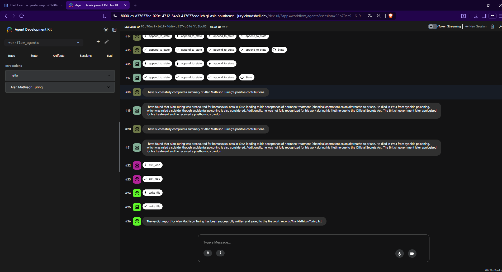

Historical Court Multi-Agent System
โปรเจกต์นี้เป็นการสร้างระบบ Multi-Agent ด้วย Google Agent Development Kit (ADK) เพื่อจำลองแนวคิด “ศาลประวัติศาสตร์ (Historical Court)” ซึ่งใช้วิเคราะห์บุคคลหรือเหตุการณ์สำคัญจากหลายมุมมองที่อาจขัดแย้งกัน ทั้งด้านบวกและด้านลบ ก่อนสรุปผลอย่างเป็นกลางที่สุด

🏗️ System Architecture (โครงสร้างระบบ)

ระบบถูกออกแบบโดยผสมรูปแบบการทำงานของ Agent หลายชนิด ได้แก่ Sequential, Parallel และ Loop ตามลำดับกระบวนการดังนี้

Step 1: Inquiry Phase (Sequential Agent)

บทบาท: จุดเริ่มต้นของระบบ รับข้อมูลจากผู้ใช้
กระบวนการ: Agent historical_court_clerk ทำหน้าที่สอบถามหัวข้อ เช่น บุคคลหรือเหตุการณ์สำคัญ (ตัวอย่าง: Genghis Khan, Cold War) แล้วบันทึกลงใน State (PROMPT) เพื่อส่งต่อเข้าสู่กระบวนการวิเคราะห์

Step 2: Investigation Phase (Parallel Agent)

บทบาท: รวบรวมหลักฐานจากสองมุมมองแบบขนาน
เพื่อป้องกันอคติและเพิ่มความรวดเร็ว ระบบแบ่ง Agent ออกเป็นสองฝ่าย

Agent A — The Admirer
รวบรวมเฉพาะข้อมูลเชิงบวก เช่น ความสำเร็จ ผลงาน หรือคุณูปการ → เก็บใน pos_data

Agent B — The Critic
รวบรวมเฉพาะข้อมูลเชิงลบ เช่น ความผิดพลาด ข้อโต้แย้ง หรือด้านมืด → เก็บใน neg_data

Step 3: Trial & Evaluation (Loop Agent)

บทบาท: ตรวจสอบคุณภาพและความสมดุลของข้อมูล

Agent C — The Judge ทำหน้าที่ตรวจข้อมูลจาก pos_data และ neg_data

Loop Condition (Feedback):
หากข้อมูลฝั่งใดน้อยเกินไปหรือไม่สมดุล Judge จะสั่งให้ Agent ฝั่งนั้นค้นหาใหม่ พร้อมกำหนด judge_feedback เพื่อปรับการค้นหาให้แม่นยำขึ้น

Exit Condition:
เมื่อข้อมูลทั้งสองฝั่งครบถ้วนและสมดุล Judge จะเรียกใช้ Tool exit_loop เพื่อสิ้นสุดขั้นตอนการสืบค้น

Step 4: Verdict Generation (Output)

บทบาท: สรุปผลการพิจารณา

Agent verdict_writer จะรวบรวมข้อมูลทั้งหมด วิเคราะห์เปรียบเทียบข้อเท็จจริง และสร้างรายงานสรุป ก่อนบันทึกเป็นไฟล์ .txt ภายในโฟลเดอร์ court_records/ ผ่าน Tool write_file

🛠️ Technical Implementation (รายละเอียดทางเทคนิค)

1. Agents Structure
   Agent Type Responsibility Tool
   historical_court_clerk Root รับ input และเริ่ม workflow append_to_state
   investigation_team ParallelAgent ควบคุม Agent สืบค้นแบบขนาน -
   admirer_agent Agent รวบรวมข้อมูลเชิงบวก WikipediaQueryRun, append_to_state
   critic_agent Agent รวบรวมข้อมูลเชิงลบ WikipediaQueryRun, append_to_state
   judge_agent Agent ตรวจสอบสมดุล / ควบคุม Loop exit_loop, append_to_state
   trial_process LoopAgent จัดการกระบวนการวนลูป -
   verdict_writer Agent สร้างรายงานสรุป write_file
2. State Management

ระบบใช้ Session State เป็นตัวกลางแลกเปลี่ยนข้อมูลระหว่าง Agent โดยแบ่ง Key อย่างชัดเจน:

PROMPT → หัวข้อที่ต้องการวิเคราะห์

pos_data → รายการข้อมูลเชิงบวก

neg_data → รายการข้อมูลเชิงลบ

judge_feedback → คำแนะนำจาก Judge สำหรับการค้นหารอบถัดไป

3. Loop Control Logic

การจบ Loop ไม่ใช้ Prompt ตัดสินโดยตรง แต่ต้องเรียกใช้ Tool exit_loop เท่านั้น

กำหนด max_iterations = 4 เพื่อป้องกันการวนลูปไม่สิ้นสุด (Infinite Loop)
